# sandboxd

Run E2B-style sandboxes as real Linux VMs on your own Apple-silicon Mac.

[](https://github.com/gitmoot/sandboxd/actions/workflows/ci.yml)
[](https://github.com/gitmoot/sandboxd/releases/latest)
[](LICENSE)
[](#requirements)

sandboxd serves an E2B-shaped HTTP API and backs every sandbox with its own
Linux ARM64 VM, created through Apple's
[`container`](https://github.com/apple/container) CLI. A root helper keeps
each VM behind a PF firewall, and a SQLite ledger tracks every VM it creates.

> [!IMPORTANT]
> sandboxd implements **only the E2B API subset that Gitmoot's pinned client
> uses**, not the full E2B SDK. The stock E2B SDKs do not work against it yet
> (see [Compatibility](#compatibility)). General SDK support is planned.

> [!NOTE]
> sandboxd is in production as Gitmoot's opt-in Mac execution provider. A real
> Gitmoot review ran end to end in one VM, which was destroyed afterwards
> ([#10](https://github.com/gitmoot/sandboxd/issues/10)).

## Why

- **Your data stays on your hardware.** Sandboxes run on your Mac, not in a
  third-party cloud.
- **A full VM per job, not a container.** Each sandbox is its own Linux VM with
  its own volume and its own network.
- **No per-minute cloud bill.** Capacity is the number of VMs your Mac can run.
- **An E2B-shaped API.** It uses E2B's endpoints, headers and response fields,
  so Gitmoot drives cloud E2B and sandboxd with one client.

## Architecture

<p align="center">
  <picture>
    <source media="(prefers-color-scheme: dark)" srcset="docs/images/architecture-dark.svg">
    
  </picture>
</p>

<sub>Diagram source: <a href="docs/images/architecture.mmd"><code>docs/images/architecture.mmd</code></a>.</sub>

- **Control plane**: create, get, list, extend and delete sandboxes, plus
  metrics. Each request needs `X-API-Key`. The ledger reserves capacity and a
  network slot before a VM exists, and reconciliation removes VMs the ledger
  does not know about.
- **Guest data plane**: file upload and process start. sandboxd runs these
  through `container exec`; there is no agent inside the guest. Each call
  needs the VM's own `envdAccessToken`.
- **PF helper**: a root launchd service that checks the slot networks and
  loads deny rules for every guest bridge. sandboxd stops guest work if that
  check fails.
- **Model relay**: off by default. When enabled, it forwards guest TCP
  connections on one fixed port to a loopback endpoint chosen by the operator.

## Compatibility

[`docs/compatibility.md`](docs/compatibility.md) is the authoritative
description. [`docs/conformance-matrix.md`](docs/conformance-matrix.md) records,
per operation, which stock E2B SDK tests pass today; CI fails when it regresses.
Summary:

| Area | E2B operation | Status | Notes |
| --- | --- | :---: | --- |
| Control | Create sandbox, `POST /sandboxes` | ✅ | One allowlisted template; requires `secure: true` and Gitmoot owner metadata; rejects `envVars` and `autoPause` |
| Control | Create sandbox, `POST /v2/sandboxes` | ❌ | Returns 404. Current SDKs create sandboxes through this path. |
| Control | Get sandbox, `GET /sandboxes/{id}` | ✅ | |
| Control | List sandboxes, `GET /v2/sandboxes` | ✅ | Paged, with `X-Next-Token` and `X-Total-Running`; a failed inventory returns 503, never an empty list |
| Control | Set timeout, `POST /sandboxes/{id}/timeout` | ✅ | Capped by `--max-ttl` |
| Control | Kill, `DELETE /sandboxes/{id}` | ✅ | Idempotent; returns 204 only once the VM is confirmed destroyed |
| Control | Metrics, `GET /sandboxes/{id}/metrics` | ✅ | Measured CPU and memory; no disk usage or cost |
| Guest | Upload file, `POST /files` | 🟡 | User `user`, paths under `/home/user` only |
| Guest | Read or download file, filesystem RPCs | ❌ | |
| Guest | Run command, `POST /process.Process/Start` | 🟡 | Connect JSON stream; no stdin; output capped at 64 MiB |
| Guest | Other process RPCs (input, signals, list, reconnect) | ❌ | |
| Routing | Wildcard host `49983-<id>.<domain>` | ✅ | Needs private wildcard DNS and TLS |
| Routing | Single gateway host with `E2b-Sandbox-Id` / `E2b-Sandbox-Port` | ✅ | The stock SDK sends these headers; point it at the gateway with `E2B_SANDBOX_URL` |
| Lifecycle | Pause and resume, snapshots | ❌ | |
| Templates | Template builds | ❌ | One image, allowlisted with `--image` |
| Network | Guest inbound ports, public guest hosts | ❌ | Not supported, by design |
| Billing | E2B dollar billing | ❌ | |

**Why the stock SDK doesn't work yet.** An unmodified E2B Python SDK (2.52.0)
fails at its first call: `Sandbox.create` sends `POST /v2/sandboxes`, and
sandboxd returns 404. If that path existed, create would still need `secure:
true` and Gitmoot's owner metadata, and the SDK could not parse some response
fields (for example `envdVersion: "sandboxd-1"` is not a version string).
Guest routing is not the obstacle: the SDK already sends the
`E2b-Sandbox-Id` / `E2b-Sandbox-Port` headers and honours `E2B_SANDBOX_URL`,
so a single-host deployment such as Tailscale Serve fits.

## Requirements

- An Apple-silicon Mac. Releases ship only a `darwin-arm64` build.
- Apple's [`container`](https://github.com/apple/container) CLI, tested with
  **1.4.1**, installed root-owned at `/usr/local/bin/container` (or pass
  `--container-cli`), with its Linux kernel installed. sandboxd starts
  Apple's services after a reboot but never installs the kernel.
- A macOS version that Apple `container` supports; sandboxd adds no
  requirement of its own.
- A dedicated unprivileged worker account that owns the Apple container
  service, and the stock `root ALL=(ALL) ALL` sudoers rule (the helper runs
  `container` as that account).
- A Linux ARM64 guest image built from
  [`images/linux-arm64/Dockerfile`](images/linux-arm64/Dockerfile).
- Private HTTPS in front of sandboxd's loopback listener (Tailscale Serve or
  an SSH tunnel).
- To build from source: Go 1.26 (`go.mod`).

## Quick start

Commands run on the Mac unless noted. Full operator details, including updates, logs
and uninstall, are in
[Operating the PF helper](docs/compatibility.md#operating-the-pf-helper).

**1. Start Apple's runtime and build the guest image** (as the worker
account, from a checkout of this repository):

```sh
container system start --enable-kernel-install
container build --platform linux/arm64 --tag sandboxd/review-go126:<version> images/linux-arm64
```

**2. Create one host-only network per concurrent VM** (a *slot*), with
distinct IPv4 subnets. Let Apple choose the IPv6 prefix.

```sh
container network create --internal --subnet 192.168.130.0/24 \
  --label gitmoot.sandboxd.network=apple-v1 sandboxd-slot-1
container network create --internal --subnet 192.168.131.0/24 \
  --label gitmoot.sandboxd.network=apple-v1 sandboxd-slot-2
```

**3. Install the PF helper and sandboxd from a release.** Open the
[release page](https://github.com/gitmoot/sandboxd/releases/latest) in your
own browser, copy the archive's SHA-256, then run this from the worker
account:

```sh
sudo sh -c 'set -e; d=$(mktemp -d /var/root/sandboxd.XXXXXX); cd "$d"; curl -fsSLO https://github.com/gitmoot/sandboxd/releases/download/<tag>/sandboxd-<tag>-darwin-arm64.tar.gz; echo "<sha256>  sandboxd-<tag>-darwin-arm64.tar.gz" | shasum -a 256 -c; tar -xzf sandboxd-<tag>-darwin-arm64.tar.gz; ./sandboxd-pf-helper install; cd /; rm -rf "$d"'
```

`install` registers the `org.gitmoot.sandboxd-pf-helper` launchd service,
installs `sandboxd` at `/usr/local/libexec/sandboxd`, and prints the
`--slot` flags that sandboxd needs. Later updates are a single command,
which verifies the release before installing it:

```sh
sudo sandboxd-helper-update
```

**4. Run sandboxd** as the worker account. The API key file must be mode
0600 and hold one value of at least 8 bytes. Keep it and the ledger outside
disposable paths.

```sh
/usr/local/libexec/sandboxd \
  --listen 127.0.0.1:43180 \
  --db <state-dir>/sandboxd.db \
  --api-key-file <state-dir>/api-key \
  --image sandboxd/review-go126:<version> \
  --template review-arm64 \
  --pin-image docker.io/library/alpine@sha256:d9e853e87e55526f6b2917df91a2115c36dd7c696a35be12163d44e6e2a4b6bc \
  --pf-socket /private/var/run/sandboxd-pf/helper.sock \
  --worker-id mac-local \
  --domain <private-domain> \
  --gateway-host <mac-host> \
  --slot name=sandboxd-slot-1,ipv4=192.168.130.0/24,gw=192.168.130.1,ipv6=<ula-prefix>/64 \
  --slot name=sandboxd-slot-2,ipv4=192.168.131.0/24,gw=192.168.131.1,ipv6=<ula-prefix>/64
```

Copy the `--slot` lines exactly as `install` printed them, in the same order.
`--pin-image` and `--worker-id` must match the helper's; the values above are
the helper's defaults. Optional flags: `--cpus` (default 2),
`--memory-mib` (default 4096), `--max-vms` (default one per slot) and
`--max-ttl` (default `1h`).

**5. Expose it privately.** sandboxd listens only on loopback. Put private
HTTPS in front of it, for example Tailscale Serve on your tailnet, or an SSH
tunnel for testing:

```sh
# On the Mac: HTTPS on your tailnet
tailscale serve --bg --https=8443 http://127.0.0.1:43180

# Or, for testing, from your client: a loopback tunnel
ssh -N -L 43180:127.0.0.1:43180 <user>@<mac-host>
```

Never expose sandboxd on a public address.

**6. Create and delete a sandbox.**

```sh
KEY=$(cat <state-dir>/api-key)

curl -sS -X POST http://127.0.0.1:43180/sandboxes \
  -H "X-API-Key: $KEY" -H 'Content-Type: application/json' \
  -d '{"templateID":"review-arm64","timeout":300,"secure":true,
       "metadata":{"job_id":"readme-demo","attempt":"1","lifecycle_generation":"0"}}'
# 201 {"sandboxID":"sandboxd-…","envdAccessToken":"…",...}

curl -sS -o /dev/null -w '%{http_code}\n' -X DELETE \
  -H "X-API-Key: $KEY" http://127.0.0.1:43180/sandboxes/<sandboxID>
# 204
```

`timeout` is in seconds. Each create needs a new `job_id`, or a higher
`attempt` for the same one; otherwise sandboxd answers 409.

## Using with Gitmoot

Declare the Mac beside Gitmoot's default cloud E2B provider in
`config.toml`:

```toml
[remote_exec.mac]
api_key_file = "/path/to/sandboxd-api-key"
template = "review-arm64"
omp_template = "review-arm64"
base_url = "https://<mac-host>:8443"
envd_base_url = "https://<mac-host>:8443"
omp_linux_arm64_file = "/path/to/omp-linux-arm64"
credential_gateway_url = "https://<first-slot-gateway>:43181"
max_concurrent = 1
```

`max_concurrent` is the Mac's capacity. `credential_gateway_url` also
requires `credential_gateway_listen` and `credential_gateway_url` in
`[remote_exec]`. A job uses the Mac only when you ask for it:

```sh
gitmoot review request --pr <number> --repo <owner>/<repo> --exec-provider mac
```

See Gitmoot's
[remote execution docs](https://github.com/gitmoot/gitmoot/blob/main/docs/remote-exec.md)
for the full provider setup.

## Security model

- **One VM per job.** Each sandbox gets its own VM, with a read-only root
  filesystem, a private volume at `/home/user` and no host mounts. Commands
  run as uid 1000.
- **One host-only network per slot.** Two guests never share a network, so
  they cannot reach each other.
- **PF firewall on every guest bridge.** The root `sandboxd-pf-helper` blocks
  guest traffic to Mac services, the LAN, the tailnet and the internet, over
  IPv4 and IPv6. sandboxd refuses to admit guests until the rules are
  loaded, and stops guest work if a later check fails.
- **Two credentials.** `X-API-Key` for the control API, and a per-VM
  `envdAccessToken` for that VM's data plane only.
- **Scoped model access, off by default.** The optional relay opens one TCP
  port on the first slot's gateway and forwards only to one loopback endpoint
  on the Mac.
- **Failure destroys the VM.** A canceled or failed command, or output over
  the cap, destroys the whole VM, not just the process.
- **Durable bookkeeping.** A SQLite ledger and reconciliation track every VM;
  an uncertain destroy keeps its capacity until it is proven gone. VMs and
  volumes carry a worker-ID label.

Not supported, by design: guest inbound ports, public guest hosts,
unauthenticated guest access, uploads outside `/home/user`, and running as
another guest user.

## Roadmap

- **General E2B SDK compatibility**, so stock SDKs work unchanged.
- **A second worker and capability-based scheduling across workers**
  ([#11](https://github.com/gitmoot/sandboxd/issues/11)).
- **Proof of recovery after a Mac reboot** with no manual step
  ([#7](https://github.com/gitmoot/sandboxd/issues/7)).

## Docs

- [`docs/compatibility.md`](docs/compatibility.md): the supported API
  subset, conformance testing, network slots, the PF helper, the model relay
  and the review image module cache.
- [Operating the PF helper](docs/compatibility.md#operating-the-pf-helper):
  install, updates, logs and uninstall.
- [`docs/firecracker.md`](docs/firecracker.md): the Linux/KVM worker
  (`-driver firecracker`), its isolation and egress model, and how to
  install and rebuild its artifacts.
- [`images/linux-arm64/Dockerfile`](images/linux-arm64/Dockerfile): the
  guest image.

## License

[Apache License 2.0](LICENSE).
